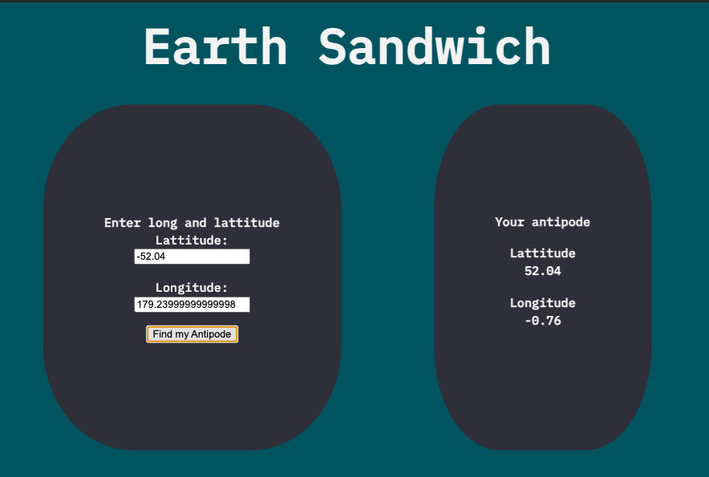
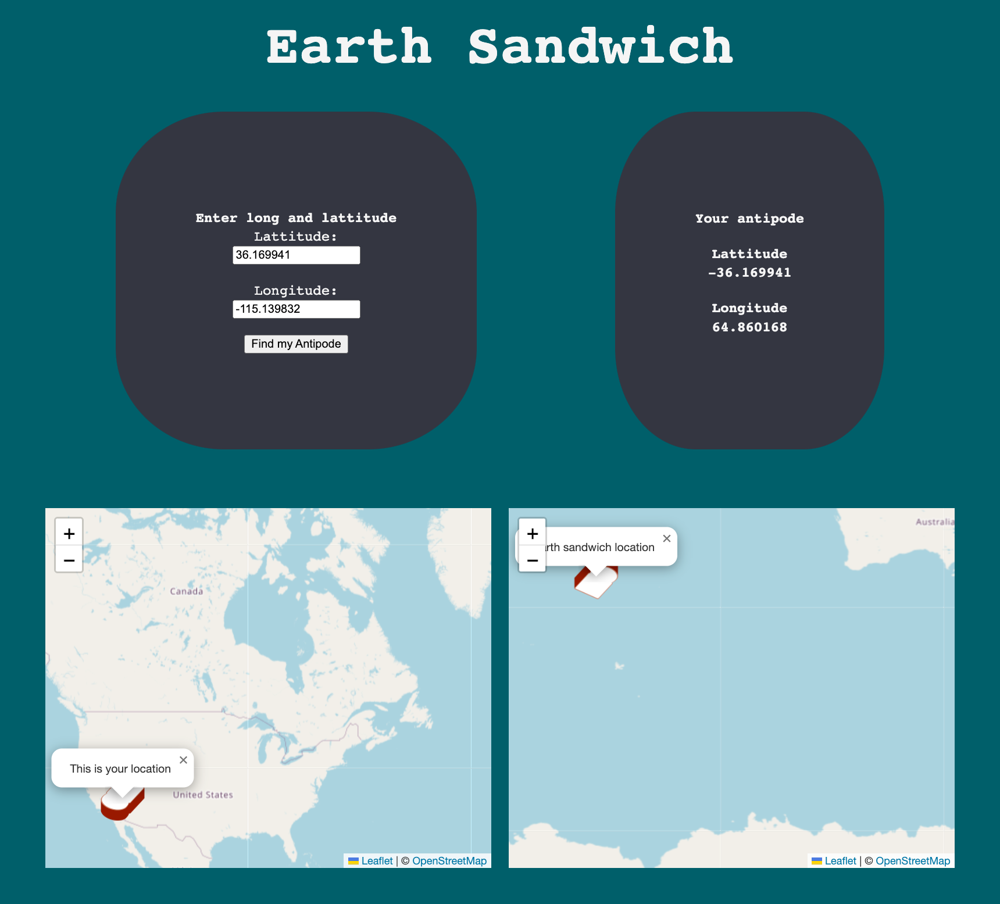
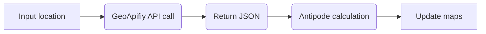

# Earth Sandwich project - Patch notes / progresss log

This personal project allowed me to experiment with a variety of systems and build a web app from the ground up using Node.js.

## V0 - Breaking down intial problem 
To start this project I first broke down at a very high level how the system should behave

 1. Take an input
 2. Math?
 3. Return output value
 4. Display this for the user to see

## V1 - Making the math work

Starting with the basics I looked into how you find the **antipode** *the direct opposite* of a given location. This is a well understood engineering problem and there was lots of examples to use.

I consulted several online calculators including [Omni Calculator](https://www.omnicalculator.com/other/antipode) to know what the correct return value from the function should be.

**Input** *(using my home town of Milton Keynes, UK)*
 - Latitude: 52.04
 - Longitude -0.76
 
 **Expected Return**
 - Latitude: 52.04 
 - Longitude: 179.24
 
 **To check it's not fluke, running the calculation backwards**
 
 

## V2 - Adding a map to make it visual

Lat and Long values aren't very useful or exicting for most people. I could only understand where it was refering to when I looked it up. To make this a better user experience I needed to remove that step.

Enter [Leaflet](https://leafletjs.com/), a popular JavaScript library that provides interactive maps. Following the quick start I made a one page file combining the HTML, CSS and JS to establish viablity and get a proof of concept quickly.

Whilst this works, it relies on users to be able to enter a valid lat/long. This is a pain for users for 3 main reasons.

 1. Knowing you lat/long requires you to look it up or have a GPS readout handy
 2. Entering 1 digit wrong can send you to a vastly different location
 3. There are several conventions for writing lat/long e.g. -52.04 is often written as 52.04 S. This adds extra complexity when parsing the inputs

The solution to this is **geocoding** a process of taking a text-input such as an address and returning geographic co-ordinates.

## V3 - Making it human accessible with geocoding
In theory this step was simple, find a geocoding service, access it and put it into the system. However at this stage the whole project was one combined html/css/js file as Leaflets documentation did not alude any other way to work with it.

Before starting I needed to plan the expected operations:

I found [geoapifiy](https://www.geoapify.com/), a location platform that offered a geocoding api, with robust documentation and a node module to boot. In order to use this I would need to refactor my current code into a Node project.

**Attempt 1 - Just Node**
To get started I installed the Leaflet NPM module, however every attempt using node lead to import and window errors from Leaflet. Essentially Leaflet tries to run before the page is rendered and I could not find a way around this.

**Attempt 2 - Node + Vite**
Upon further reading and experimentation I found that [Vite](https://vitejs.dev/) could process the Leaflet module. With this now working I could get an API key and integrate the geoapifiy modules.

## Earth Sandwich
As it stands right now, the user can enter a location, use the autocomplete picker for ease and then watch as the map updates in a smooth fashion. The extra animation step makes it far more immersive then a simple reload.

# Lessons learnt
I came into this project as a novice of node and wanted to push myself to make something, interactive, fun and educational.

 1. **How to interact with Leaflet.** This experience will help me as I explore and seek to work with more third party resources.
 2. **Debugging node module errors.** Not as obvious as the errors I encoutered ranged from my code sending unexpected inputs to functions in the modules or modules not communicating with each other. The more I break things the better I will get at solving these problems
 3. **How to set up vite for devlopment and using it to build production code.** My first time interacting with build tools, I know these are used widely for more complex devlopment projects so it is a skill I need to be comfortable with.
 4. **Deploying projects to the web** to make them a real entity for people to interact with. Finding ways to take the code from local to online took longer than I estimated even thought the end deployment via netilfy was in itself simple. Code needs to be shipped and used to be useful.
 5. **The importance of reading documentation and thorough planning.** Any real sticking points I had during this typically came from misunderstanding a piece of documentation or planning at too high a level.

## Future plans

To take this project to it's final form I will need to recreate this using **3js** as to get the full interactive and experience it needs to be shown on a 3d globe. Seeing two maps side by side whilst accurate doesn't communicate very effectively the postional reality to users.
