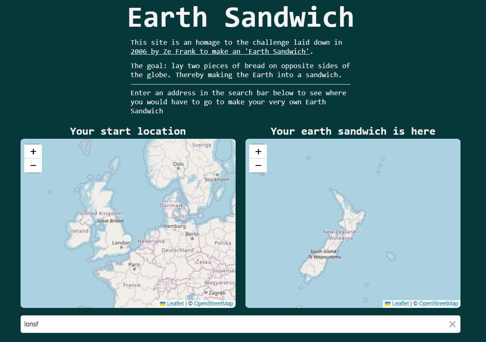

# Earth Sandwich

Earth Sandwich is a web application that simplifies the challenge of creating the perfect global sandwich by helping you locate the exact opposite side of the Earth from your location. It's a fun and educational tool inspired by Ze Frank's global sandwich challenge.



## Features

- **Effortless Geolocation**: Earth Sandwich utilizes geocoding and autocomplete features, allowing you to input any address, and it will calculate the precise latitude and longitude coordinates for both you and your "sandwich" location.

- **Interactive Map**: We've incorporated the Leaflet mapping library to create an interactive map that displays your location and the antipodal point with ease.

- **Optimized for Node**: The application has been optimized to work with Node.js using Vite, making it easy to run and deploy on your own server.

## Usage

Use the following commands to get started:

```
npm install

npm run dev
```

## Dependencies

- **vite**: A build tool that leverages JavaScript ES modules to deliver fast, optimized web applications.

- **leaflet**: A popular JavaScript library for interactive maps, used for displaying the Earth Sandwich locations.

- **express**: A minimal and flexible Node.js web application framework for building web applications and APIs.

- **@geoapify/geocoder-autocomplete**: Provides geocoding and autocomplete functionality for location searches.

- **@geoapify/leaflet-address-search-plugin**: A plugin for Leaflet that enables address searches and location selection on the map.

## Next Steps

Roadmap includes:
- Integrate geocoding for address lookups, eliminating the need for manual latitude and longitude inputs.
- Allow location selection by selecting a point on the map
- 3d graphical display using D3.

## Contributors

<a href="https://github.com/Mart510">
        
</a>